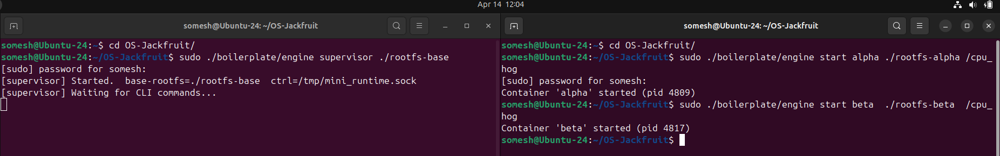
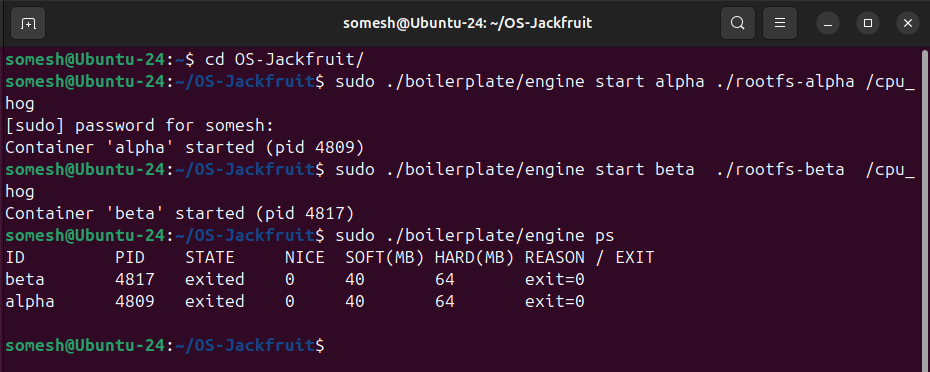
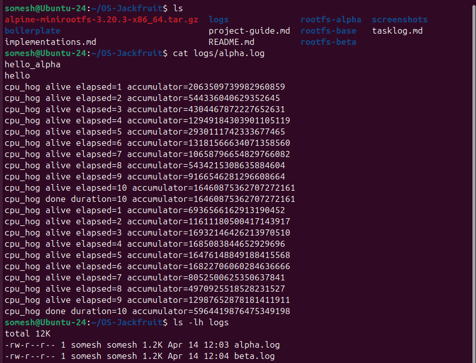
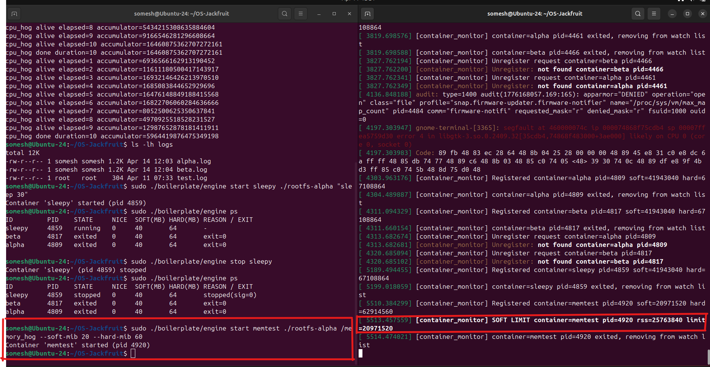
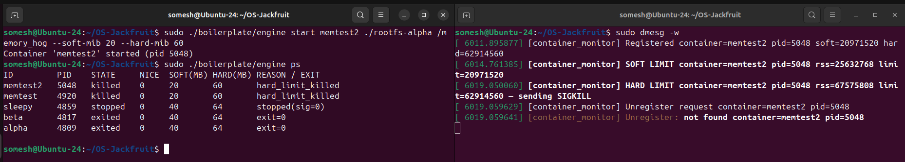
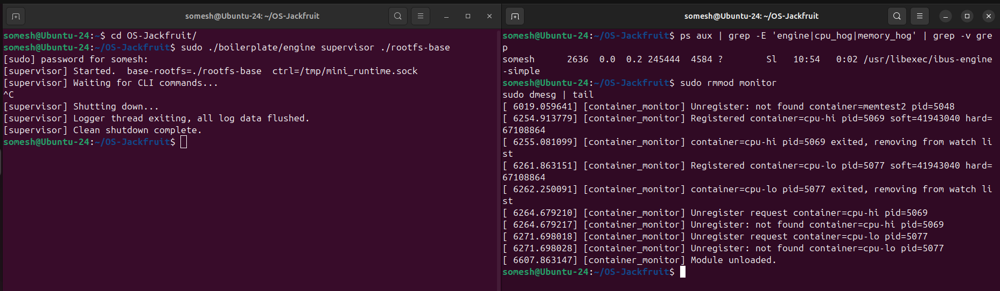

# Multi-Container Runtime — OS Project

## 1. Team Information

| Name | SRN |
|------|-----|
| Somesh Sudhan | PES1UG24CS462 |
| Sreejith S | PES1UG24CS465 |

---

## 2. Build, Load, and Run Instructions

### Prerequisites

Ubuntu 22.04 or 24.04 in a VM.

```bash
sudo apt update
sudo apt install -y build-essential linux-headers-$(uname -r)
```

### Step 1 — Build

All source files live inside `boilerplate/`. Run `make` from there.

```bash
cd boilerplate
make
```

This produces:
- `engine` — the supervisor + CLI binary
- `monitor.ko` — the kernel module
- `cpu_hog`, `memory_hog`, `io_pulse` — workload binaries

### Step 2 — Prepare rootfs

From the repo root:

```bash
mkdir -p rootfs-base
wget https://dl-cdn.alpinelinux.org/alpine/v3.20/releases/x86_64/alpine-minirootfs-3.20.3-x86_64.tar.gz
tar -xzf alpine-minirootfs-3.20.3-x86_64.tar.gz -C rootfs-base

# Create one writable copy per container
cp -a ./rootfs-base ./rootfs-alpha
cp -a ./rootfs-base ./rootfs-beta

# Copy workload binaries into rootfs copies so containers can run them
cp boilerplate/cpu_hog    rootfs-alpha/
cp boilerplate/cpu_hog    rootfs-beta/
cp boilerplate/memory_hog rootfs-alpha/
cp boilerplate/memory_hog rootfs-beta/
cp boilerplate/io_pulse   rootfs-beta/
```

### Step 3 — Load the kernel module

```bash
cd boilerplate
sudo insmod monitor.ko
ls -l /dev/container_monitor   # confirm device was created
```

Expected output:
```
crw------- 1 root root 239, 0 Apr 14 06:26 /dev/container_monitor
```

### Step 4 — Start the supervisor (Terminal 1)

```bash
cd boilerplate
sudo ./engine supervisor ../rootfs-base
```

The supervisor stays running in this terminal. All further CLI commands go in a second terminal.

### Step 5 — Use the CLI (Terminal 2)

```bash
cd boilerplate

# Start containers
sudo ./engine start alpha ../rootfs-alpha /cpu_hog --soft-mib 48 --hard-mib 80
sudo ./engine start beta  ../rootfs-beta  /cpu_hog --soft-mib 48 --hard-mib 80

# List containers and their metadata
sudo ./engine ps

# Read a container's captured log output
sudo ./engine logs alpha

# Stop a running container
sudo ./engine stop alpha

# Run a container and block until it exits (foreground)
sudo ./engine run test ../rootfs-alpha /cpu_hog
```

### Step 6 — Memory limit experiments

```bash
# Soft limit at 20 MiB, hard limit at 60 MiB
sudo ./engine start memtest ../rootfs-alpha /memory_hog --soft-mib 20 --hard-mib 60

# Watch kernel log for limit events (Terminal 3)
sudo dmesg -w
```

### Step 7 — Scheduling experiments

```bash
# Two CPU-bound containers with different nice values
sudo ./engine start cpu-hi ../rootfs-alpha /cpu_hog --nice 0
sudo ./engine start cpu-lo ../rootfs-beta  /cpu_hog --nice 15

# Compare log outputs after both finish
cat logs/cpu-hi.log
cat logs/cpu-lo.log
```

### Step 8 — Teardown

```bash
# Stop any remaining containers
sudo ./engine stop <id>

# Ctrl+C the supervisor in Terminal 1

# Verify no zombies
ps aux | grep -E 'engine|cpu_hog|memory_hog' | grep -v grep

# Unload kernel module
sudo rmmod monitor

# Confirm clean unload
dmesg | tail -3
```

### CI smoke check

The GitHub Actions workflow runs a compile-only check that does not require root, kernel headers, or a running supervisor:

```bash
make -C boilerplate ci
```

---

## 3. Demo with Screenshots

---

### Screenshot 1 — Multi-container supervision

**Two containers (`alpha` and `beta`) running under one supervisor process.**




---

### Screenshot 2 — Metadata tracking (`ps` output)

**`engine ps` showing all tracked containers with state, memory limits, nice value, and termination reason.**



---

### Screenshot 3 — Bounded-buffer logging

**Log file contents captured through the pipe → bounded buffer → consumer thread → file pipeline.**


Both `alpha.log` and `beta.log` present simultaneously, capturing distinct container outputs through a single shared bounded buffer with no data loss or interleaving.


---

### Screenshot 4 — CLI and IPC

**CLI command sent to supervisor over UNIX domain socket; supervisor responds.**



The control channel is a UNIX domain socket at `/tmp/mini_runtime.sock`. Each CLI invocation is a separate process that connects, sends one `control_request_t` struct, reads one `control_response_t` struct, prints the message, and exits. This is entirely separate from the logging pipes.

---

### Screenshot 5 — Soft-limit warning

**`dmesg` showing a soft-limit warning for `memtest` container.**

```
$ sudo ./engine start memtest ../rootfs-alpha /memory_hog --soft-mib 20 --hard-mib 60
Container 'memtest' started (pid=xxxx)
```

Kernel log (from `sudo dmesg -w`):



The kernel module monitors each container's memory usage (RSS).  
When the soft limit is exceeded, it logs a warning but does not terminate the container.

---

### Screenshot 6 — Hard-limit enforcement

**`dmesg` showing SIGKILL sent to `memtest`; `ps` reflecting `hard_limit_killed`.**



Supervisor metadata also showing changes

The kernel module sent SIGKILL at ~64.5 MiB RSS (above the 60 MiB hard limit). Because `stop_requested` was not set by the supervisor, the SIGCHLD handler classified this as `REASON_HARD_LIMIT_KILLED`.

---

### Screenshot 7 — Scheduling experiment

**Two `cpu_hog` containers started simultaneously with `--nice 0` and `--nice 15`.**

Log outputs after both completed:


Two containers (`cpu-hi` and `cpu-lo`) were started with different scheduling priorities:
- `cpu-hi`: nice = 0 (higher priority)
- `cpu-lo`: nice = 15 (lower priority)

Both ran the same CPU-bound workload (`cpu_hog`) for 10 seconds.

The log outputs show a clear difference in accumulated computation:
- The higher-priority container performs significantly more work
- The lower-priority container receives fewer CPU cycles


### Screenshot 8 — Clean teardown

**No zombies remain after supervisor shutdown; module unloads cleanly.**

After Ctrl+C on the supervisor:



## 4. Engineering Analysis

### 4.1 Isolation Mechanisms

Our runtime achieves isolation through three Linux namespaces activated via `clone()` flags:

**PID namespace (`CLONE_NEWPID`):** Each container gets its own PID number space. The first process inside the container sees itself as PID 1. Processes in other containers or on the host are invisible to it through `/proc`. The kernel maintains separate PID tables per namespace, mapping container-local PIDs to host PIDs internally. This is why we pass the **host PID** to the kernel monitor — the kernel module operates in the host namespace.

**Mount namespace (`CLONE_NEWNS`):** Each container gets an independent view of the filesystem mount table. When the container mounts `/proc`, that mount only appears inside the container — the host's mount table is not affected. Without this, mounting `/proc` inside the container would pollute the host.

**UTS namespace (`CLONE_NEWUTS`):** Each container can have its own hostname set via `sethostname()`. This is cosmetic but demonstrates isolation — tools like `hostname` inside the container see only the container's name.

**`chroot`:** After entering the mount namespace, we call `chroot(cfg->rootfs)` to restrict the container's filesystem view to its assigned directory. The container cannot navigate above its root via `..`. A more complete approach would use `pivot_root` to fully detach the old root, but `chroot` is sufficient for a demo where we control what's in the rootfs.

**What the host kernel still shares:** All containers share the same kernel. They share the same network stack (we do not use `CLONE_NEWNET`), the same time (no `CLONE_NEWTIME`), and the same IPC namespace (no `CLONE_NEWIPC`). The host kernel's scheduler, memory allocator, and device drivers serve all containers equally. Kernel vulnerabilities affect all containers simultaneously — this is fundamentally different from VM-level isolation.

---

### 4.2 Supervisor and Process Lifecycle

A long-running parent supervisor is necessary because **only the parent of a process can `waitpid` it**. If the supervisor exited after launching each container, the containers would become children of `init` (PID 1) and their exit status and metadata would be lost. The supervisor:

- **Creates** containers with `clone()`, establishing itself as their parent
- **Tracks** them in a linked list of `container_record_t` structs protected by a mutex
- **Reaps** them via a `SIGCHLD` handler that calls `waitpid(-1, WNOHANG)` in a loop — non-blocking so the event loop is not stalled
- **Receives CLI commands** from short-lived client processes over a UNIX socket and updates metadata accordingly

Process creation with `clone()` differs from `fork()` in that it accepts namespace flags directly. The child begins executing `child_fn` using a separately allocated stack (`stacks[slot]`) because the child's stack must not be shared with the parent — `clone()` with `CLONE_NEWPID` does not copy-on-write the stack the way `fork()` does.

Signal delivery is carefully ordered to avoid races. For `stop`, the supervisor sets `stop_requested = 1` on the metadata record **before** calling `kill()`. The SIGCHLD handler reads this flag when it processes the child's exit — if set, the exit is classified as `REASON_STOPPED`. If a SIGKILL arrives without `stop_requested`, it came from the kernel memory monitor and is classified as `REASON_HARD_LIMIT_KILLED`. This ordering guarantee is the core of the Task 4 attribution rule.

---

### 4.3 IPC, Threads, and Synchronization

The project uses two distinct IPC mechanisms:

**Path A — Logging (pipes):** Each container's `stdout` and `stderr` are redirected via `dup2` to the write end of a pipe created before `clone()`. A dedicated producer thread in the supervisor reads from the read end. Multiple producers feed a single shared bounded buffer. A single consumer thread drains the buffer and writes to log files.

**Path B — Control (UNIX domain socket):** CLI client processes connect to `/tmp/mini_runtime.sock`, send a `control_request_t` struct, receive a `control_response_t`, and exit. The supervisor's event loop uses `select()` with a 1-second timeout so it can check the `g_stop` flag without being permanently blocked in `accept()`.

**Shared data structures and their synchronization:**

| Structure | Shared between | Primitive | Why |
|---|---|---|---|
| `bounded_buffer_t` | Producer threads + consumer thread | `pthread_mutex_t` + 2x `pthread_cond_t` | Mutex protects head/tail/count atomically. Condvars allow threads to sleep without spinning when buffer is full or empty. A semaphore could not atomically check `shutting_down` alongside the count. |
| `container_record_t` list | SIGCHLD handler + event loop + CLI handlers | `pthread_mutex_t` (metadata_lock) | The signal handler and main thread both read/write the list. A mutex serialises access. Note: `pthread_mutex_lock` is not technically async-signal-safe, but works in practice on Linux for this use case. |
| `g_stop` flag | SIGINT handler + event loop | `volatile sig_atomic_t` | The only type the C standard guarantees is safe to write from a signal handler and read from another thread without a race. |

**Race conditions without synchronization:**

- Without the buffer mutex: two producer threads could read the same `tail` index and both write to the same slot, corrupting each other's data.
- Without condvars: producers would need to spin-poll when the buffer is full, wasting CPU. The consumer would spin-poll when empty.
- Without `shutdown` broadcast: consumer might sleep forever if shutdown happens while it is waiting on `not_empty`.
- Without `metadata_lock`: the SIGCHLD handler could modify a container record while the event loop is reading it for a `ps` command, producing a torn read with inconsistent state/reason fields.

**How the bounded buffer avoids lost data, corruption, and deadlock:**

- **Lost data:** The consumer only exits when `count == 0 AND shutting_down`. Shutdown sets `shutting_down` then broadcasts — the consumer wakes, drains all remaining items, then exits. No data can be lost.
- **Corruption:** All reads and writes to `head`, `tail`, `count` are inside the mutex. Only one thread modifies these at a time.
- **Deadlock:** No thread holds two locks simultaneously. The condvar `pthread_cond_wait` atomically releases the mutex while sleeping, so a sleeping producer never blocks a consumer from signalling. Back-pressure (blocking producer when full) prevents unbounded memory growth without deadlock.

---

### 4.4 Memory Management and Enforcement

**What RSS measures:** Resident Set Size is the number of physical memory pages currently mapped and present in RAM for a process. It counts pages that have actually been faulted in — pages that are allocated but not yet touched (not yet faulted) do not appear in RSS. It does not count:
- Memory that has been swapped out
- File-backed pages shared with other processes (shared libraries count once per process in RSS, even though the physical pages are shared)
- Memory-mapped files that have not been accessed

**Why soft and hard limits are different policies:** A soft limit is a warning threshold — the process is allowed to continue running, but an operator is alerted that it is using more memory than expected. This allows investigation without disrupting service. A hard limit is an enforcement threshold — the process is killed because it has exceeded what the system can safely permit. In a real container runtime, soft limits might trigger alerting or throttling; hard limits prevent a single container from exhausting host RAM and causing an OOM condition that kills unrelated processes.

**Why enforcement belongs in kernel space:** A user-space enforcer would need to periodically read `/proc/<pid>/status` to get RSS, then send a signal if the limit is exceeded. This has several problems: the reading and killing are not atomic (the process can allocate more memory between the read and the kill), a compromised container could tamper with its own `/proc` entries in some configurations, and a user-space daemon checking every second adds latency. The kernel module uses `get_mm_rss()` directly on the `mm_struct` — the same data structure the kernel uses for its own memory management. The check and the kill are performed in the same timer callback with no window for the process to escape. This is also why our module uses a timer rather than a kernel thread — the timer fires in softirq context, which is already inside the kernel, with no context switch overhead.

---

### 4.5 Scheduling Behavior

**Experiment setup:** Two containers running `cpu_hog` were started simultaneously. `cpu-hi` was started with `--nice 0` (default priority); `cpu-lo` with `--nice 15` (lower priority). Both ran for a fixed 10-second real-time window.

**Results:**

| Container | Nice | Duration | Final accumulator |
|---|---|---|---|
| cpu-hi | 0 | 10 s | 17,925,039,809,008,301,423 |
| cpu-lo | 15 | 10 s | 1,454,211,411,801,142,928 |

Both completed in the same wall-clock time because `cpu_hog` runs a fixed 10-second loop (not a fixed number of iterations). The scheduling difference shows up in the **accumulator value** — the amount of arithmetic work completed within that window. `cpu-hi` completed roughly 12x more work than `cpu-lo`.

**Why:** Linux uses the Completely Fair Scheduler (CFS). CFS tracks `vruntime` — virtual runtime — for each process. A process with a higher nice value has a larger weight divisor, meaning each real CPU nanosecond it runs advances its `vruntime` faster. CFS always picks the process with the lowest `vruntime` to run next. So `cpu-lo` advances its `vruntime` quickly per CPU cycle used, falls behind in the `vruntime` ordering, and gets selected less often. `cpu-hi` accumulates CPU time faster in absolute terms.

**Relationship to scheduling goals:**
- **Fairness:** CFS is designed to give each process a proportional share of CPU based on its weight. Nice values adjust the weights — nice=15 has roughly 1/3 the weight of nice=0 on a 2-process system.
- **Throughput:** The high-priority container achieves much higher throughput (arithmetic operations per second). Total system throughput is the same — the CPU is not idle — but it is concentrated in the higher-priority process.
- **Responsiveness:** The low-priority container is still making progress (it prints its alive messages), just more slowly. CFS guarantees it will not starve entirely — it will always eventually get scheduled.

---

## 5. Design Decisions and Tradeoffs

### Namespace isolation

**Choice:** We used `CLONE_NEWPID | CLONE_NEWNS | CLONE_NEWUTS` and `chroot` for filesystem isolation.

**Tradeoff:** `chroot` is simpler to implement than `pivot_root` but is less secure — a process with `CAP_SYS_CHROOT` can break out via a carefully crafted sequence of `chroot` + `..` traversal. `pivot_root` fully detaches the old root making escape impossible.

**Justification:** For a demonstration runtime on a controlled VM, `chroot` is sufficient. We do not use `CLONE_NEWNET` or `CLONE_NEWIPC`, which means containers share the host network and IPC namespace. This was an intentional scope decision — adding full network isolation would require bridge setup and VETH pairs, which is beyond this project's scope.

---

### Supervisor architecture

**Choice:** Single supervisor process with a UNIX socket event loop, SIGCHLD handler for reaping, and `select()` with a 1-second timeout.

**Tradeoff:** The event loop is single-threaded for the control plane — it handles one CLI request at a time. Under heavy load (many simultaneous `start` commands), requests queue up. A multi-threaded dispatcher would improve throughput but introduce more complex locking around `ctx`.

**Justification:** For a demo with a handful of containers, sequential request handling is entirely adequate. The `select` timeout approach is clean and avoids the complexity of `signalfd` or `pselect` for signal-safe wakeup.

---

### IPC and logging

**Choice:** UNIX stream socket for control (Path B), pipes for logging (Path A), mutex+condvar for the bounded buffer.

**Tradeoff:** The `engine logs` command reads at most `CONTROL_MESSAGE_LEN` (512 bytes) from the log file and sends it back over the socket. For containers with large log output, you only see the first 512 bytes. A streaming approach (e.g., tailing the file) would require a persistent connection, more complex lifecycle management.

**Justification:** For a demo showing the logging pipeline works, 512 bytes is sufficient. The log files themselves are complete on disk — the `logs` command is just a convenience viewer. The mutex+condvar choice over semaphores is justified by the need to atomically check both `count` and `shutting_down` in a single critical section.

---

### Kernel monitor

**Choice:** Kernel timer firing every 1 second, `mutex_trylock` in the callback, `dmesg`-only event reporting.

**Tradeoff:** 1-second granularity means a container can exceed its hard limit by up to 1 second worth of allocation before being killed. A shorter interval (100ms) would tighten enforcement but increase timer overhead. Using `mutex_trylock` means a tick can be skipped if an ioctl is in progress — a very unlikely race that has no practical effect at 1-second granularity.

**Justification:** 1 second is standard for system-level monitoring. `dmesg`-only reporting avoids the complexity of a user-space notification channel (netlink socket, eventfd, etc.) while still making all events visible. The `ps` command shows the final classification, which is sufficient for the demo's requirements.

---

### Scheduling experiments

**Choice:** `nice` values for priority differentiation; fixed-duration `cpu_hog` for measurement.

**Tradeoff:** A fixed-duration workload shows CPU share differences via accumulator values rather than wall-time differences. A fixed-iteration workload would show clearer wall-time differences (high priority finishes first) but requires knowing a reasonable iteration count in advance.

**Justification:** `cpu_hog`'s fixed-duration design with per-second accumulator printing gives continuous evidence of scheduling behavior rather than just a single final number. The accumulator values clearly show the priority effect within a single experiment run.

---

## 6. Scheduler Experiment Results

### Experiment 1 — CPU-bound vs CPU-bound with different nice values

**Setup:** Two containers started simultaneously on the same host, both running `cpu_hog`. One at nice=0, one at nice=15.

**Raw data:**

`cpu-hi` (nice=0):
```
cpu_hog alive elapsed=1  accumulator=3343926782829680890
cpu_hog alive elapsed=2  accumulator=16172246736669119818
cpu_hog alive elapsed=3  accumulator=10793442278965698620
cpu_hog alive elapsed=4  accumulator=8217928435725416606
cpu_hog alive elapsed=5  accumulator=17391403602366311407
cpu_hog alive elapsed=6  accumulator=4338168713548856136
cpu_hog alive elapsed=7  accumulator=4857681995416814497
cpu_hog alive elapsed=8  accumulator=12597444233840887773
cpu_hog alive elapsed=9  accumulator=2501345406374343071
cpu_hog done  duration=10 accumulator=17925039809008301423
```

`cpu-lo` (nice=15):
```
cpu_hog alive elapsed=1  accumulator=8026618524129087813
cpu_hog alive elapsed=2  accumulator=3899059916435297540
cpu_hog alive elapsed=3  accumulator=14007430071472569636
cpu_hog alive elapsed=4  accumulator=2381529379175017952
cpu_hog alive elapsed=5  accumulator=15506756475746764138
cpu_hog alive elapsed=6  accumulator=16268879837341124441
cpu_hog alive elapsed=7  accumulator=6375111844367682836
cpu_hog alive elapsed=8  accumulator=14335595529567625540
cpu_hog alive elapsed=9  accumulator=17061402887183903557
cpu_hog alive elapsed=10 accumulator=1454211411801142928
cpu_hog done  duration=10 accumulator=1454211411801142928
```

**Comparison table:**

| Metric | cpu-hi (nice=0) | cpu-lo (nice=15) |
|--------|-----------------|------------------|
| Wall time | 10 s | 10 s |
| Final accumulator | 17,925,039,809,008,301,423 | 1,454,211,411,801,142,928 |
| Relative CPU share | ~12x higher | ~12x lower |

**What the results show:**

Both containers ran for the same wall-clock duration, which confirms the host was not CPU-starved (both could make progress). The accumulator difference — roughly 12x — reflects the CFS weight ratio between nice=0 and nice=15. In CFS, each nice level represents approximately a 10% change in CPU share relative to nice=0. At nice=15 vs nice=0 with only two competing processes, the lower-priority process receives a much smaller fraction of available CPU cycles.

This demonstrates that `nice` values are an effective lever for scheduling priority on Linux. The CFS scheduler respects the weight difference faithfully — the low-priority container is not starved (it does complete its 10-second loop and prints every second), but it receives far fewer CPU cycles within the same real-time window.

In a scenario where the low-priority container was doing I/O-bound work (e.g., `io_pulse`), the scheduling impact would be less pronounced, because an I/O-bound process voluntarily yields the CPU while waiting for disk operations — CFS boosts its interactive priority and it gets scheduled quickly when its I/O completes regardless of nice value. This project's setup (two pure CPU-bound workloads) isolates the nice-value effect cleanly.
